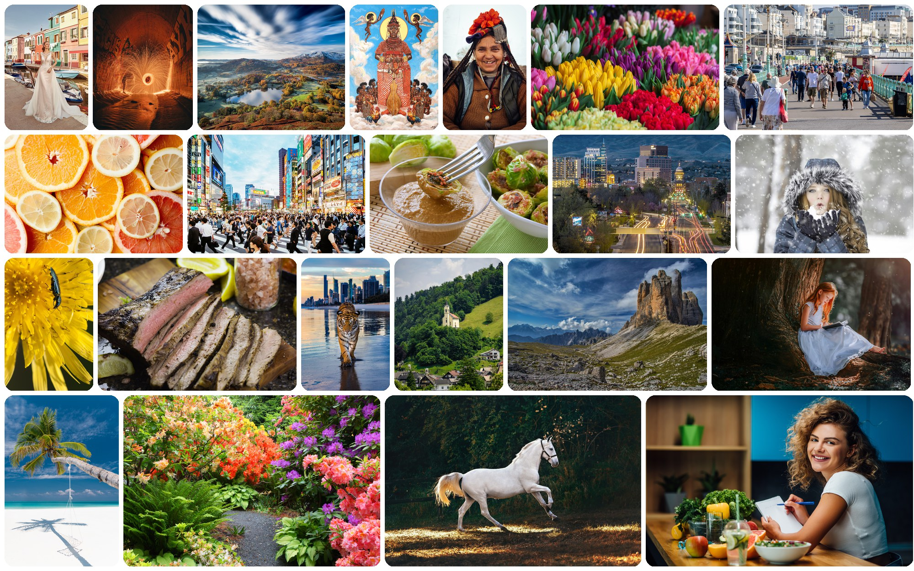

<div align="center">

# 4KLSDB: A Large-Scale Dataset for 4K Image Restoration and Text-to-Image Generation

<p><strong><a href="https://openreview.net/forum?id=VW0Fvdfv1k">DataCV @ CVPR 2026</a> · Accepted 🎉</strong></p>

<p>
  <a href="https://taco-group.github.io/4KLSDB/"></a>
  <a href="https://huggingface.co/datasets/SingleBicycle/4KLSDB"></a>
  <a href="https://huggingface.co/datasets/SingleBicycle/4KLSDB/tree/main/ckpts"></a>
  <a href="https://openreview.net/forum?id=VW0Fvdfv1k"></a>
  <a href="LICENSE"></a>
</p>

<p>
  <strong>Zihao Zhu</strong><sup>1</sup>, Kuan-Ru Huang<sup>1</sup>, Zhaoming Xu<sup>1</sup>, Renjie Li<sup>1</sup>,
  Bo Wu<sup>1</sup>, Ruizheng Bai<sup>1</sup>, Mingyang Wu<sup>1</sup>, Sayak Paul<sup>2</sup>,
  <strong>Zhengzhong Tu</strong><sup>†,1,3</sup>
</p>

<p><sup>1</sup>Texas A&M University &nbsp;&nbsp; <sup>2</sup>Hugging Face &nbsp;&nbsp; <sup>3</sup>Visko Platform</p>



</div>

---

## TL;DR

**4KLSDB** is the first openly released **native-4K** image dataset that scales to **129k+** training images and is designed for **both** image restoration and generation research. Every model in our paper — **HiT-SR**, **SwinIR**, **MambaIR**, **OSEDiff**, **SeeSR**, and **Sana** — gets a consistent and substantial boost when fine-tuned on 4KLSDB.

* 🖼️ **Dataset**: 129,484 train / 2,000 val / 1,984 test, all native-4K, with captions, on [🤗 Hugging Face](https://huggingface.co/datasets/SingleBicycle/4KLSDB).
* 🧱 **Pre-trained checkpoints**: every SR/T2I model released under [🤗 taco-group](https://huggingface.co/taco-group).
* 🚀 **One-click inference**: ready-to-run scripts for each model under [`scripts/`](scripts/).
* 🏋️ **One-click training**: reproducible YAML configs and shell scripts under [`models/`](models/).

---

## 📰 News

* **2026-05** — Public release of dataset, code, and pretrained weights.
* **2026-05** — Paper released on arXiv.

---

## 📑 Table of Contents

- [Highlights](#-highlights)
- [Dataset](#-dataset)
- [Pre-trained Models](#-pre-trained-models)
- [Quick Start](#-quick-start)
  - [Environment](#environment)
  - [Download Everything (one script)](#download-everything-one-script)
  - [Classical SR Inference (HiT-SR / SwinIR / MambaIR)](#classical-sr-inference)
  - [Real-World SR Inference (OSEDiff / SeeSR)](#real-world-sr-inference)
  - [4K T2I Inference (Sana)](#4k-t2i-inference)
- [Training](#-training)
- [Benchmark Results](#-benchmark-results)
- [Repository Structure](#-repository-structure)
- [Citation](#-citation)
- [Acknowledgements](#-acknowledgements)
- [License](#-license)

---

## ✨ Highlights

- **Native 4K** — every image meets a minimum dimension of **3840 px** and a **3840 × 2160** pixel budget.
- **Scale** — **129,484** training images, **22× larger** than DIV8K, **150× larger** than DIV2K.
- **Quality pipeline** — Q-Align aesthetic scoring + Laplacian/Sobel texture filtering + **two human annotators per image**.
- **Dual-purpose** — works out-of-the-box for **classical SR** (×4 / ×8 / ×16), **real-world SR**, and **4K T2I generation**.
- **Reproducibility** — all training configs, blind-degradation pipeline, and evaluation code are included.

---

## 📦 Dataset

The 4KLSDB dataset is hosted on Hugging Face:

> https://huggingface.co/datasets/SingleBicycle/4KLSDB

```python
from datasets import load_dataset

# Streaming (recommended — the train split is ~1.5 TB)
ds = load_dataset("SingleBicycle/4KLSDB", split="train", streaming=True)
for ex in ds:
    print(ex["image"], ex["caption"])
    break
```

| Split | #Images | Format            | Notes                                                   |
|-------|--------:|-------------------|---------------------------------------------------------|
| train | 129,484 | image + caption   | LAION-2B + Photo Concept Bucket + PD12M, native 4K      |
| val   |   2,000 | image + caption   | held-out, balanced across categories                    |
| test  |   1,984 | image + caption + paired LR/HR | for both classical and real-world SR benchmark |

Categories covered: nature, urban scenes, people, food, artwork, CGI, animals, architecture.

---

## 🧱 Pre-trained Models

All 4KLSDB-fine-tuned checkpoints live alongside the dataset under
[`SingleBicycle/4KLSDB/ckpts/`](https://huggingface.co/datasets/SingleBicycle/4KLSDB/tree/main/ckpts).

| Family               | Model      | Path on Hub                                                                                                                     | Best for                |
|----------------------|------------|---------------------------------------------------------------------------------------------------------------------------------|-------------------------|
| Classical SR         | HiT-SR     | [`ckpts/hit_sr/`](https://huggingface.co/datasets/SingleBicycle/4KLSDB/tree/main/ckpts/hit_sr)                                  | ×4 / ×8 / ×16 PSNR/SSIM |
| Classical SR         | SwinIR     | [`ckpts/swinir/`](https://huggingface.co/datasets/SingleBicycle/4KLSDB/tree/main/ckpts/swinir)                                  | ×4 / ×8 / ×16 PSNR/SSIM |
| Classical SR         | MambaIR    | [`ckpts/mambair/`](https://huggingface.co/datasets/SingleBicycle/4KLSDB/tree/main/ckpts/mambair)                                | strongest classical SR  |
| Real-World SR        | OSEDiff    | [`ckpts/osediff/x4/`](https://huggingface.co/datasets/SingleBicycle/4KLSDB/tree/main/ckpts/osediff)                             | one-step diffusion SR   |
| Real-World SR        | SeeSR      | [`ckpts/seesr/`](https://huggingface.co/datasets/SingleBicycle/4KLSDB/tree/main/ckpts/seesr)                                    | semantics-aware Real-SR |
| 4K T2I Generation    | Sana 4096² | [`ckpts/sana/`](https://huggingface.co/datasets/SingleBicycle/4KLSDB/tree/main/ckpts/sana)                                      | native 4096×4096 T2I    |

> One-shot download of every model:
>
> ```bash
> bash scripts/download_all_ckpts.sh        # → release_ckpts/<model>/
> ```

> **New (May 2026):** the dataset now ships an authoritative
> [`metadata.jsonl`](https://huggingface.co/datasets/SingleBicycle/4KLSDB/blob/main/metadata.jsonl)
> with **Qwen2.5-VL-7B** recaptions for all 129,484 training images.
> Use this for T2I fine-tuning instead of the older `caption` column in the parquet shards.

---

## 🚀 Quick Start

### Environment

We strongly recommend using a separate conda environment per model family.

```bash
# Classical SR & Real-SR (HiT-SR / SwinIR / MambaIR / OSEDiff / SeeSR)
conda env create -f envs/4k_sr.yml
conda activate 4k_sr

# 4K T2I generation (Sana)
conda env create -f envs/Sana_training.yml
conda activate Sana
```

### Download Everything (one script)

```bash
bash scripts/download_all_ckpts.sh                # → release_ckpts/
huggingface-cli download SingleBicycle/4KLSDB \
    --repo-type=dataset --local-dir ./data/4KLSDB
```

### Classical SR Inference

```bash
bash scripts/inference_classical_sr.sh \
    --model hit_sr          \   # or swinir / mambair
    --scale 4               \   # 4, 8, or 16
    --input  data/4KLSDB/test/LR_x4 \
    --output results/hit_sr_x4
```

### Real-World SR Inference

```bash
bash scripts/inference_real_sr.sh \
    --model seesr           \   # or osediff
    --scale 4               \
    --input  data/4KLSDB/test/LR_real_x4 \
    --output results/seesr_x4
```

### 4K T2I Inference

```bash
bash scripts/inference_sana_4k.sh \
    --prompt "A serene mountain lake at sunrise, 4K, photorealistic" \
    --resolution 4096 \
    --output results/sana_4k.png
```

Run `bash scripts/<name>.sh --help` for the full list of options on any script.

---

## 🏋️ Training

Each model lives as a submodule under `models/<name>` with its own training entry-point. The shell scripts below wrap the upstream configs and inject 4KLSDB-specific paths so a single command reproduces the paper.

```bash
# Classical SR
bash scripts/train_hit_sr.sh   --scale 4   --data data/4KLSDB
bash scripts/train_swinir.sh   --scale 8   --data data/4KLSDB
bash scripts/train_mambair.sh  --scale 16  --data data/4KLSDB

# Real-World SR (blind degradation pipeline)
bash scripts/train_osediff.sh  --scale 4   --data data/4KLSDB
bash scripts/train_seesr.sh    --scale 4   --data data/4KLSDB

# 4K T2I
bash scripts/train_sana_4k.sh  --resolution 4096  --data data/4KLSDB
```

Detailed per-model docs:

* [`models/sana/README.md`](models/sana/README.md) — Sana 4K fine-tuning + Gemma-2 caption embedding pre-compute.
* [`dataset/README.md`](dataset/README.md) — curation pipeline (resolution / Q-Align / Laplacian / Sobel / manual review).

---

## 📊 Benchmark Results

### Classical Super-Resolution on 4KLSDB Test Set

| Model | ×4 PSNR / SSIM | ×8 PSNR / SSIM | ×16 PSNR / SSIM |
|-------|----------------|----------------|------------------|
| HiT-SR (pretrained)        | 24.50 / 0.6839 | 22.25 / 0.6394 | 19.47 / 0.5741 |
| **HiT-SR (4KLSDB)**        | **29.27 / 0.7896** | **24.75 / 0.6928** | **23.69 / 0.6414** |
| SwinIR (DF2K)              | 24.11 / 0.6738 | 20.96 / 0.5915 | 19.20 / 0.5684 |
| **SwinIR (4KLSDB)**        | **28.79 / 0.7774** | **25.89 / 0.6877** | **23.69 / 0.6376** |
| MambaIR (pretrained)       | 25.92 / 0.7259 | 21.51 / 0.6382 | 19.47 / 0.5741 |
| **MambaIR (4KLSDB)**       | **30.92 / 0.8216** | **23.84 / 0.7195** | **23.69 / 0.6414** |

### Real-World SR (4KLSDB Test Set, baseline / ours)

| Method  | Scale | PSNR↑ | SSIM↑ | LPIPS↓ | DISTS↓ | FID↓ |
|---------|:----:|-------|-------|--------|--------|------|
| OSEDiff | ×4  | 27.36 / **27.50** | 0.7511 / **0.7568** | 0.2863 / **0.2546** | 0.1604 / **0.1431** | 28.07 / **28.35** |
| OSEDiff | ×8  | 23.86 / **24.10** | 0.6021 / **0.6188** | 0.5463 / **0.4252** | 0.1833 / **0.1448** | 19.56 / **17.74** |
| OSEDiff | ×16 | 22.65 / **22.69** | **0.6213** / 0.5966 | 0.6571 / **0.4866** | 0.2861 / **0.2170** | 51.76 / **33.97** |
| SeeSR   | ×4  | 27.01 / **28.25** | 0.6996 / **0.7340** | 0.5231 / **0.4511** | 0.1407 / **0.1272** | 38.95 / **33.88** |
| SeeSR   | ×8  | 24.10 / **24.50** | 0.6510 / **0.6713** | 0.5117 / **0.4628** | 0.1607 / **0.1551** | 77.46 / **74.46** |
| SeeSR   | ×16 | 24.02 / **24.43** | 0.6810 / **0.7001** | 0.5594 / **0.5197** | 0.1699 / **0.1640** | 77.41 / **74.40** |

### 4K Text-to-Image Generation (Sana)

| Model            | pCLIPScore↑ | pNIQE↓ |
|------------------|------------:|-------:|
| Sana (baseline)  | 28.62       | 5.21   |
| **Sana + 4KLSDB**| **29.27**   | **4.63** |

Double-blind user study win rate of **Sana + 4KLSDB** over **Sana**: **57.3% overall**, **60.9% detail**, **74.3% realism**, **64.4% fewer artifacts**, **52.3% alignment**.

---

## 🗂 Repository Structure

```
4KLSDB/
├── README.md                     # this file
├── docs/                         # GitHub Pages project page (index.html)
│   ├── index.html                # https://taco-group.github.io/4KLSDB/
│   └── assets/                   # teaser & figure JPGs used by the project page
├── envs/
│   ├── 4k_sr.yml                 # classical SR + real-SR (HiT-SR / SwinIR / MambaIR / OSEDiff / SeeSR)
│   ├── Sana_training.yml         # 4K T2I (Sana)
│   └── 4k_data_curation.yml      # dataset filtering / Q-Align scoring
├── dataset/
│   ├── README.md                 # dataset curation pipeline doc
│   ├── preprocessing/            # Q-Align / Laplacian / Sobel filters
│   └── validation/               # manual inspection Flask app
├── models/
│   ├── README.md
│   ├── sana/                     # 4K T2I submodule (NVlabs/Sana)
│   ├── hit_sr/                   # → submodule placeholder
│   ├── swinir/                   # → submodule placeholder
│   ├── mambair/                  # → submodule placeholder
│   ├── seesr/                    # → submodule placeholder
│   └── osediff/                  # → submodule placeholder
├── scripts/                      # one-click inference / training / download wrappers
│   ├── download_all_ckpts.sh
│   ├── inference_classical_sr.sh
│   ├── inference_real_sr.sh
│   ├── inference_sana_4k.sh
│   ├── train_hit_sr.sh
│   ├── train_swinir.sh
│   ├── train_mambair.sh
│   ├── train_osediff.sh
│   ├── train_seesr.sh
│   └── train_sana_4k.sh
└── LICENSE
```

---

## 📝 Citation

If you find 4KLSDB useful for your research, please cite:

```bibtex
@inproceedings{zhu2026_4klsdb,
  title     = {4KLSDB: A Large-Scale Dataset for 4K Image Restoration and Text-to-Image Generation},
  author    = {Zhu, Zihao and Huang, Kuan-Ru and Xu, Zhaoming and Li, Renjie and
               Wu, Bo and Bai, Ruizheng and Wu, Mingyang and Paul, Sayak and Tu, Zhengzhong},
  booktitle = {DataCV @ CVPR 2026},
  year      = {2026},
  url       = {https://openreview.net/forum?id=VW0Fvdfv1k}
}
```

---

## 🙏 Acknowledgements

Our work builds on a number of excellent open-source projects:

- [HiT-SR](https://github.com/XiangZ-0/HiT-SR), [SwinIR](https://github.com/JingyunLiang/SwinIR), [MambaIR](https://github.com/csguoh/MambaIR)
- [OSEDiff](https://github.com/cswry/OSEDiff), [SeeSR](https://github.com/cswry/SeeSR)
- [Sana](https://github.com/NVlabs/Sana)
- [Q-Align](https://github.com/Q-Future/Q-Align)
- Image sources: [LAION-2B](https://laion.ai/blog/laion-5b/), [Photo Concept Bucket](https://huggingface.co/datasets/ptx0/photo-concept-bucket), [PD12M](https://huggingface.co/datasets/Spawning/PD12M)

The project page is adapted from the [SparkVSR](https://sparkvsr.github.io/) template.

---

## ⚖️ License

The **code** in this repository is released under the [MIT License](LICENSE).
The **4KLSDB dataset** is released for research purposes only; please refer to the [dataset card](https://huggingface.co/datasets/SingleBicycle/4KLSDB) for the full terms and source-dataset licenses.
